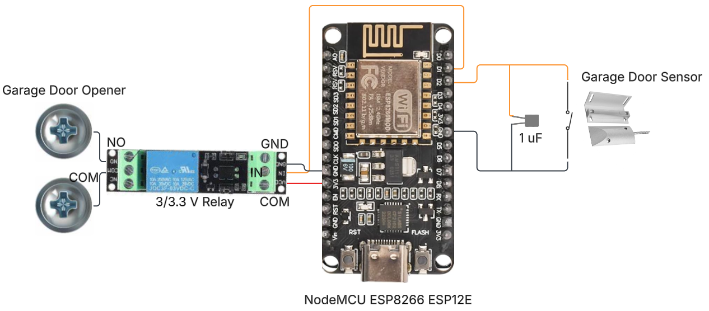
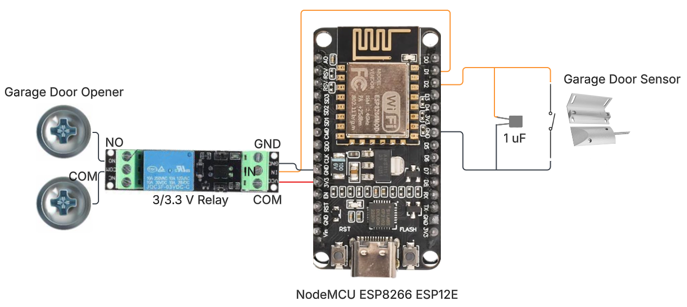

# Smart Garage Opener

## Goals 
- Create a wifi enabled or bluetooth enabled garage door opener that is able to integrate with Home Assistant. 
  - Detect the state of the garage door.
  - Control the garage door remotely.
- Refresh my memory about various computer engineering concepts. 

## Materials

### Smart Garage Door Opener

- 1 [Magnetic Reed Switch](https://www.amazon.com/dp/B0BCYHBKVF?ref=ppx_yo2ov_dt_b_fed_asin_title)
- 1 [NodeMCU ESP8266 ESP12-F](https://www.amazon.com/dp/B09QXHWLTJ?ref=ppx_yo2ov_dt_b_fed_asin_title&th=1)
- 1 [3v3 Relay](https://www.amazon.com/dp/B07XGZSYJV?ref=ppx_yo2ov_dt_b_fed_asin_title)
- 1 uF capacitor
- 1 small breadboard
- [Jumper wires](https://www.amazon.com/dp/B0BTT31CBC?ref=ppx_yo2ov_dt_b_fed_asin_title)
- [22 guage wire](https://www.amazon.com/dp/B07TX6BX47?ref=ppx_yo2ov_dt_b_fed_asin_title)

### Smart Home (Home Assistant)

- [Raspberry PI 5](https://www.amazon.com/dp/B0D95QBKJ4?ref=ppx_yo2ov_dt_b_fed_asin_title&th=1)
- [Home Assistant OS](https://www.home-assistant.io/installation/raspberrypi/)

## Home Assistant Setup

- Add [MQTT](https://www.home-assistant.io/integrations/mqtt) integration.
- Add device YAML configurations. See below.

### YAML Configurations

These configurations need to be defined in `configuration.yaml`. There are a multitude of options for [editing this file](https://www.home-assistant.io/docs/configuration/#to-set-up-access-to-the-files-and-prepare-an-editor). 

#### Cover YAML

```yaml
cover:
  - name: Garage Door
    unique_id: "garage_door"
    availability:
      - topic: "garage_door/availability"
        payload_available: "available"
        payload_not_available: "unavailable"
    command_topic: "garage_door/buttonpress"
    payload_stop:
    state_topic: "garage_door/status"
    device:
      name: "Smart Garage Door Opener"
      via_device: "esp8266"
      model: "Arduino Mega"
      manufacturer: "Arduino"
      identifiers: "arduino_garage_door_opener"
```

#### Sensor YAML

```yaml
sensor:
  - name: Garage Door Sensor
    availability:
      - topic: "garage_door/availability"
        payload_available: "available"
        payload_not_available: "unavailable"
    state_topic: "garage_door/status"
    unique_id: "garage_door_sensor"
    force_update: true
    device_class: enum
    options:
      - open
      - closed
      - opening
      - closing
```

## MQTT Details

TODO: Maybe add information here and/or an .md doc detailing learnings and information about MQTT, birth and will messages, availability messages.

## Smart Garage Door Schematic




- D0 -> Relay -> Garage Door Opener terminals
- Reed Switch Sensor -> Capacitor (In parallel) -> D1

## Journey and roadblocks

TODO: Maybe sublink to a .md file in the docs folder.

Might use [this guide / repo](https://github.com/skills/github-pages) to create a blog hosted on this github repo, using GitHub Pages. Another [docs page](https://docs.github.com/en/pages/setting-up-a-github-pages-site-with-jekyll/about-github-pages-and-jekyll). This could also lead to a new project creating my own website to point to these projects. I think it's best to make this repo have the end result of this project, but at the top of the readme, I can link to a blog that details how I got here.

Some things to include in the journey were that I started with a very small esp8266, used an fdti to flash. Then, didn't want to deal with the limitations of some of the pins when it came to development, I'd have to do special things when flashing, and also unplug a bunch to flash, and didn't want to deal with that. Switched to esp12e, had issues and also simply learned about 12f, switched, had rfi issues, slowly investigated, took a couple week break, then investigated again, tried the capacitor on the reed switch. Come to think of it, I actually originally started with an arduino, but it was cheaper to use an esp. 

## Future work

- Create packaging for the microcontroller and wiring. 
- Investigate relocating the smart garage door opener to on top of the garage door opener, rather than the attic. This will be cleaner and mitigate wire usage.