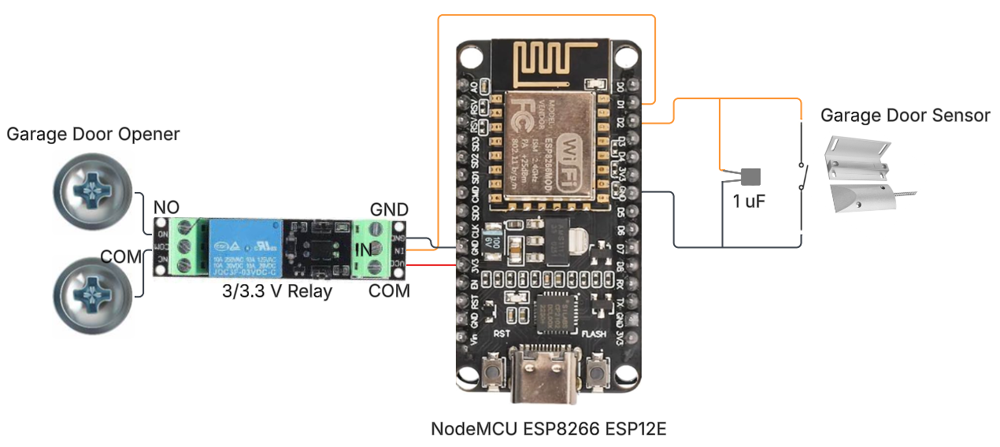

# Smart Garage Opener

## Goals 
- Create a wifi enabled or bluetooth enabled garage door opener that is able to integrate with Home Assistant. 
  - Detect the state of the garage door.
  - Control the garage door remotely.
- Refresh my memory about various computer engineering concepts. 
- Refresh my C++ programming. 

## Journey and roadblocks

Check out the blog post documenting my journey [here](https://garrettcampbell3.github.io/)!

## Materials

### Smart Garage Door Opener

- 1 [Magnetic Reed Switch](https://www.amazon.com/dp/B0BCYHBKVF?ref=ppx_yo2ov_dt_b_fed_asin_title)
- 1 [NodeMCU ESP8266 ESP12-F](https://www.amazon.com/dp/B09QXHWLTJ?ref=ppx_yo2ov_dt_b_fed_asin_title&th=1)
- 1 [3v3 Relay](https://www.amazon.com/dp/B07XGZSYJV?ref=ppx_yo2ov_dt_b_fed_asin_title)
- 1 uF capacitor
- 1 small breadboard
- [Jumper wires](https://www.amazon.com/dp/B0BTT31CBC?ref=ppx_yo2ov_dt_b_fed_asin_title)
- [22 guage wire](https://www.amazon.com/dp/B07TX6BX47?ref=ppx_yo2ov_dt_b_fed_asin_title)

- Garage Door opener is a WhisperDrive 1/2 HP. 
  - The measured voltage across terminals is 5.84V.

### Smart Home (Home Assistant)

- [Raspberry PI 5](https://www.amazon.com/dp/B0D95QBKJ4?ref=ppx_yo2ov_dt_b_fed_asin_title&th=1)
- [Home Assistant OS](https://www.home-assistant.io/installation/raspberrypi/)

## Home Assistant Setup

- Add [MQTT](https://www.home-assistant.io/integrations/mqtt) integration.
- Add device YAML configurations. See below.

### YAML Configurations

These configurations need to be defined in `configuration.yaml`. There are a multitude of options for [editing this file](https://www.home-assistant.io/docs/configuration/#to-set-up-access-to-the-files-and-prepare-an-editor). 

#### Cover YAML

```yaml
cover:
  - name: Garage Door
    unique_id: "garage_door"
    availability:
      - topic: "garage_door/availability"
        payload_available: "available"
        payload_not_available: "unavailable"
    command_topic: "garage_door/buttonpress"
    payload_stop:
    state_topic: "garage_door/status"
    device:
      name: "Smart Garage Door Opener"
      via_device: "esp8266"
      model: "Arduino Mega"
      manufacturer: "Arduino"
      identifiers: "arduino_garage_door_opener"
```

#### Sensor YAML

```yaml
sensor:
  - name: Garage Door Sensor
    availability:
      - topic: "garage_door/availability"
        payload_available: "available"
        payload_not_available: "unavailable"
    state_topic: "garage_door/status"
    unique_id: "garage_door_sensor"
    force_update: true
    device_class: enum
    options:
      - open
      - closed
      - opening
      - closing
```

## Smart Garage Door Schematic



- D0 -> Relay -> Garage Door Opener terminals
- Reed Switch Sensor -> Capacitor (In parallel) -> D1

Power is provided through the USB connection on the NodeMCU.

## Future work

- Create packaging for the microcontroller and wiring.
- Consider adding another reed switch to explicitly sense when the garage door is fully open.
